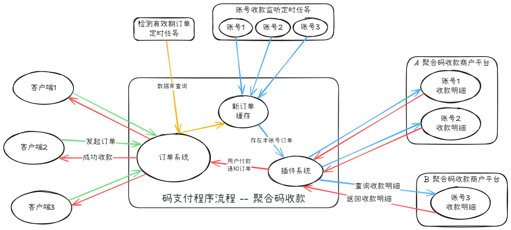

    

    <a href="https://gitee.com/technical-laohu/mpay" target="_blank">项目主页</a> ｜
    <a href="https://gitee.com/technical-laohu/mpay/releases" target="_blank">源码下载</a> ｜
    <a href="https://f0bmwzqjtq2.feishu.cn/docx/HBVrdrsACo36bzxUCSPcjOBNnyb" target="_blank">使用文档</a> ｜
    <a href="https://f0bmwzqjtq2.feishu.cn/docx/FtphdDA10oBfPyxNEEZc5mgJnqf" target="_blank">常见问题</a> ｜
    <a href="https://f0bmwzqjtq2.feishu.cn/docx/OjlwdPunLoGjL0xodMUcS0xFngX" target="_blank">学习交流</a> ｜
    <a href="https://f0bmwzqjtq2.feishu.cn/docx/PjwOdvBeZoQEHUxF2ZScTjHOnKb" target="_blank">赞赏作者</a>

 

    😎免签约、🧩多通道、🛜不掉线 - 专注于个人在线收款💴

## 项目介绍

**码支付[mpay]是一款便捷收款工具，专注于个人免签收款，通过普通收款码即可实现收款通知自动回调，支持绝大多数商城系统**

| 
gitee
 | 
github
 |
| :----------: | :------------: |
| ||

## ✨ 特性

- 支持第四方收款服务商聚合码收款，免挂机、不掉线
- 支持微信、支付宝个人账户收款，免签约
- 采用易支付接口标准开发，兼容市面上大部分商城系统
- 在H5环境中，能正常长按识别扫码支付
- 支持多平台、多账号、多通道，灵活配置，收款轮询

## ✨ 思路

### 服务商聚合码

码支付说到底就是通过二维码来进行收款，日常使用的除了微信支付宝生成的二维码外，还有一类二维码是由收款服务商提供的，它能通过一张收款二维码，同时支持**微信**、**支付宝**、**云闪付**等多渠道付款，一般称为**聚合收款码**。

这类收款码扫码之后需要用户自己输入指定金额来进行付款，然后查看收款通知，确认是否到账，最后确认订单支付成功。

就像你去店子里买一瓶水，你扫二维码进去付款界面，就生成了一个订单，你付款成功之后，商店老板会去查看一下商户后台流水，确认订单是否支付成功，这是一个人工审核的过程。

那么码支付的作用，就是让人工审核变成自动审核的，当用户通过网站购买商品的时候，码支付会生成一个订单并展示收银台界面，用户再扫码进入聚合码付款页面。

同一时间，**码支付后台会自动通过账号密码登陆聚合码服务平台的管理后台**，并通过API接口，循环查询最近的收款明细，通过比对金额和时间，确认是否付款到账，最后确认成功收款。

当用户付款成功，并且后台检测到收款成功消息后，收钱台就会提示收款成功，并最终确认收款。

> 只有存在新订单时，且该订单与当前收款账号一致时，码支付后台才会主动登陆该账号，查询收款流水，减少频繁查询导致的可能风险

> 另外，在账号设置里也有两个模式可选，`单次监听`和`连续监听`，根据业务场景可以自行选择，具体使用，下面有介绍